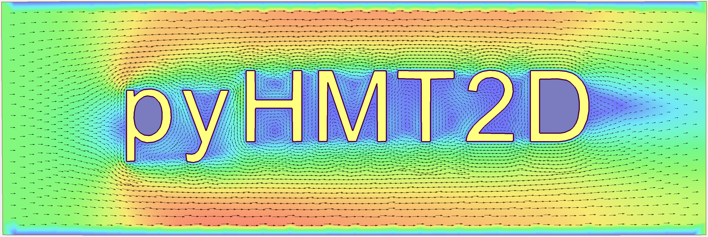

(contents)=
# pyHMT2D

```{raw} html
<div class="banner" style="text-align:center">
    <a href="https://github.com/psu-efd/pyHMT2D"></a>
    <h2>A Python tool library for two-dimensional hydraulic modeling</h2>
</div>
```

This is the pyHMT2D documentation and API reference. More detailed information about how to use pyHMT2D, algorithms, implementations, and some of the theoretical background are in the user manual.

```{toctree}
:maxdepth: 3
:caption: Contents

readme
api
```

## Indices and tables

- {ref}`genindex`
- {ref}`modindex`
- {ref}`search`
