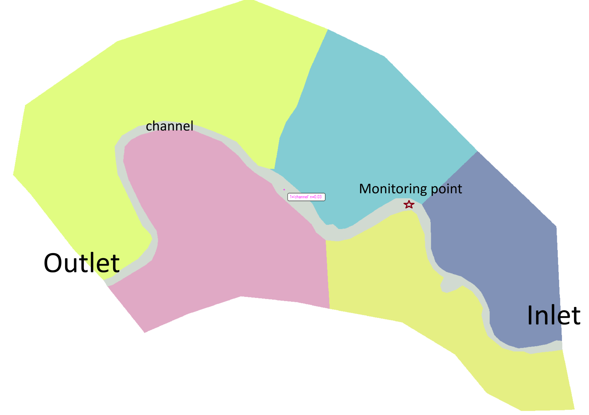

# Demonstrate the use of **pyHMT2D**'s for Monte Carlo simulation

This example demonstrates how to use **pyHMT2D**'s for Monte Carlo (MC) simulation. MC simulation is a powerful tool for uncertainty analysis. In this example, we show how to use **pyHMT2D**'s to perform MC simulation for the Manning's $n$ of the main channel in the "Muncie" case. MC simulations with both SRH-2D and HEC-RAS 2D are performed.

**Figure 1**: Scheme of the MC simulation. The main channel is the one with the Manning's $n$ that is changed in the MC simulation. A monitoring point is located upstream of the main channel. Water surface elevation (WSE) at the monitoring point is recorded and used to calculate the exceedance probability of the WSE.


## Generate the Manning's $n$ samples

The Manning's n parameter samples are generated in "`generate_parameters`": 
```bash
cd generate_parameters
python generate_Monte_Carlo_parameters.py
```

The python script will generate the Manning's $n$ samples and save to the `sampledManningN_YYYY_MM_DD-HH_MM_SS_PM.dat` file with a time stamp. Copy this parameter file to the `SRH_2D` and `HEC_RAS_2D` folders so it can be used. 

## Run the MC simulations

Go to the `SRH_2D` and `HEC_RAS_2D` folders and run the MC simulations by running the following commands (replace `<parameter_file>` with the parameter file you copied to the folders):
```bash
cd SRH_2D
python demo_SRH_2D_Monte_Carlo.py <parameter_file>
```
or 

```bash
cd HEC_RAS_2D
python demo_HEC_RAS_Monte_Carlo.py <parameter_file>
```

## Postprocess the results

The MC simulations save each result in a separate directory. The result is in VTK format and can be processed for statistics. The WSE at the monitoring point is analyzed to calculate the exceedance probability of the WSE.

**Figure 2**: Exceedance probability of the WSE at the monitoring point with HEC-RAS 2D and SRH-2D.


## Parallel or serial simulation

The MC simulations will run in parallel or serial, depending on the `bParallel` variable in the python script. If parallel simulation is used, the number of cores to use can be specified by the `nProcess` variable in the python script. Make sure you don't use more cores than the number of available cores on your machine. The parallel simulation is performed using the `multiprocessing` module in Python. Thus, it can only be used in one computer.