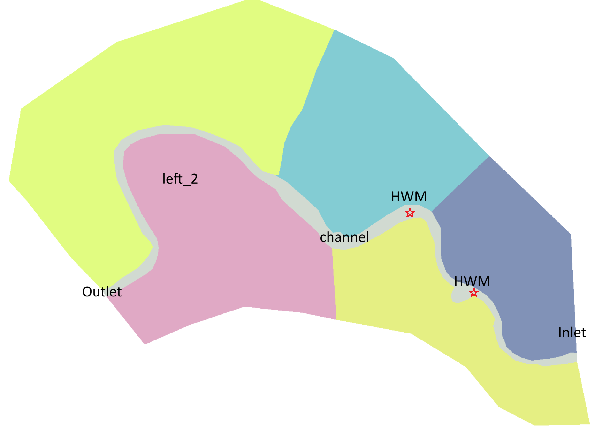
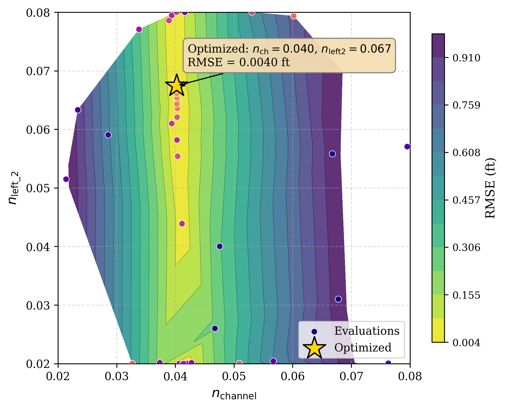

# Demonstrate the use of **pyHMT2D**'s for calibration

This example demonstrates how to calibrate the Manning's $n$ for the main channel and one floodplain in the "Muncie" case using **pyHMT2D**'. The calibration is based on high water marks provided in the file `HWMs.dat`. The HWMs are synthetically generated from the "Muncie" case with the Manning's $n$ values 0.04 and 0.06 for the main channel and one floodplain, respectively.

**Figure 1**: Scheme of the case: the main channel and one floodplain (left_2)'s Manning's $n$ are calibrated. The locations of the two high water marks are labeled in the figure. 

The calibration is performed using the gp_minimize function from the scikit-optimize library. After the calibration, the results are saved and the optimization trajectory is plotted. For both SRH-2D and HEC-RAS 2D cases, the calibration successfully find a solution close to the true Manning's $n$ values after 50 function evaluations. Even better result can be obtained with more function evaluations.

**Figure 2**: Optimization trajectory: the sampled Manning's $n$ values and the objective function value contour are plotted.
