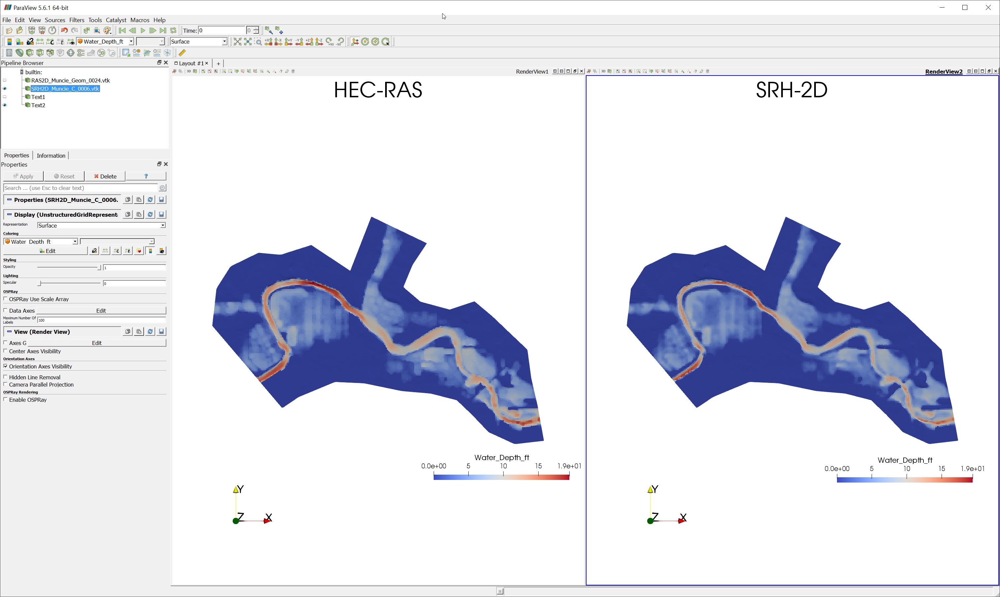
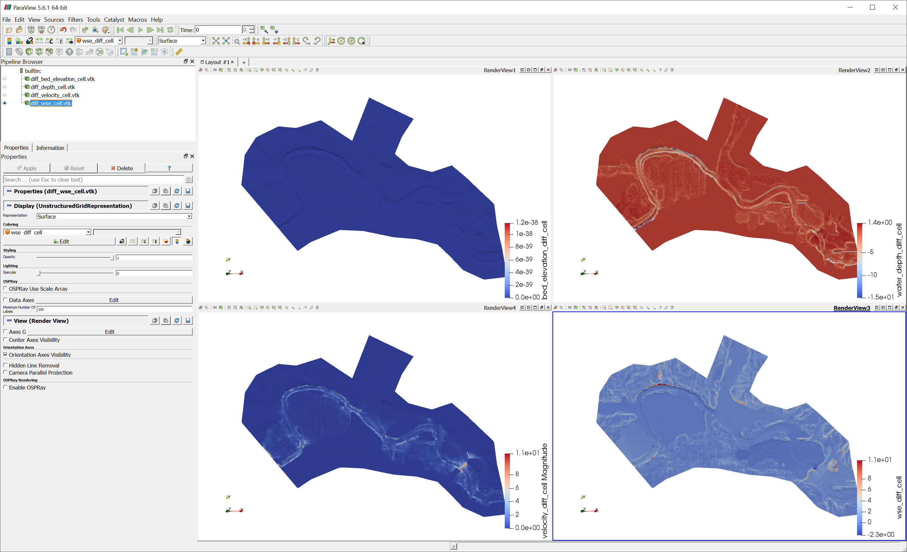

# Readme

This is a more realistic case using the terrain data in the "Muncie" example that comes with HEC-RAS.
The domain is a simple 2D flow area with one inlet (fixed discharge) and one outlet (fixed water
surface elevation). Other things such as hydraulic structures and 1D channels can exist in the
HEC-RAS case. However, **pyHMT2D**'s `RAS_2D_Data` class does not process these — if your case
includes them, you may need to add them to the SRH-2D case manually.

To perform the comparison, follow these steps:

- In folder `HEC-RAS`, load the case in HEC-RAS (version 6.6) and run the simulation to get results.
- Run `python process_RAS_2D_Data.py`: it uses `HEC_RAS_Project` to open the project, load results
  via `plan.load_results()`, convert the HEC-RAS 2D mesh and Manning's n to SRH-2D (generating
  `Muncie.srhgeom` and `Muncie.srhmat`), and export results to VTK.
- Copy `Muncie.srhgeom` and `Muncie.srhmat` to the `SRH-2D` folder. The `Muncie.srhhydro` file
  has already been provided there.
- In folder `SRH-2D`, run the SRH-2D case (assuming Aquaveo SMS 13.4):

```bash
# run SRH-2D pre-processor to generate the DAT file
"C:\Program Files\SMS 13.4 64-bit\python\Lib\site-packages\srh2d_exe\SRH_Pre_Console.exe" 3 Muncie.srhhydro

# run SRH-2D to generate the HDF file
"C:\Program Files\SMS 13.4 64-bit\python\Lib\site-packages\srh2d_exe\SRH-2D_Console.exe" Muncie.DAT
```

- Run `python process_SRH_2D_Data.py`: it will process SRH-2D results and save to VTK.
- Run `python compare_SRH_2D_HEC_RAS_2D.py`: it reads the VTK result files from both models,
  calculates differences, and saves difference VTK files for inspection in ParaView.

Comparison of water depth simulated by HEC-RAS and SRH-2D:



Difference between HEC-RAS and SRH-2D in bed elevation, water depth, velocity, and WSE:


