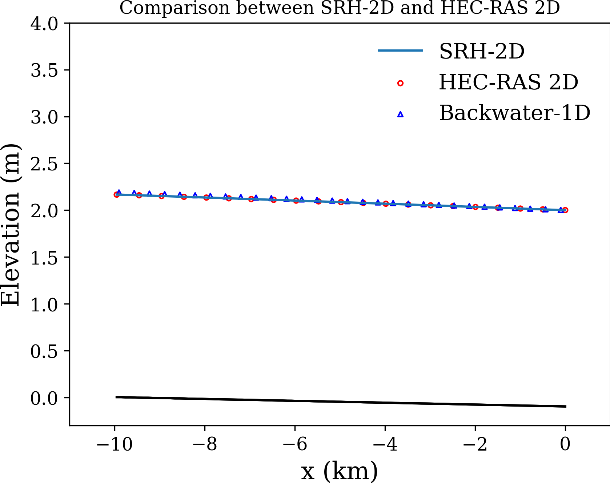

Readme
==============================================

To perform the comparison, the order of steps is as follows:

-  Run "create_channel_terrain.py": it will create the constant slope channel terrain in GeoTiff format, which can be used in HEC-RAS for case building.
-  In folder "HEC-RAS-2D", build the simple 2D case with the created terrain. Run the case to get result.
-  Run "process_RAS_2D_Data.py": it will process HEC-RAS 2D result and save to VTK. It will also convert HEC-RAS 2D mesh and Manning's n to SRH-2D.
-  In folder "SRH-2D", run SRH-2D to get result.
-  Run "process_SRH_2D_Data.py": it will process SRH-2D result and save to VTK.
-  Run "compare_SRH_2D_HEC_RAS_2D.py": it will read the two VTK result files from both SRH-2D and HEC-RAS 2D, sample the water surface profile, run a simple Backwater-1D solver, and finally plot all profiles in one figure.

    Comparison of backwater curves using *pyHMT2D*

